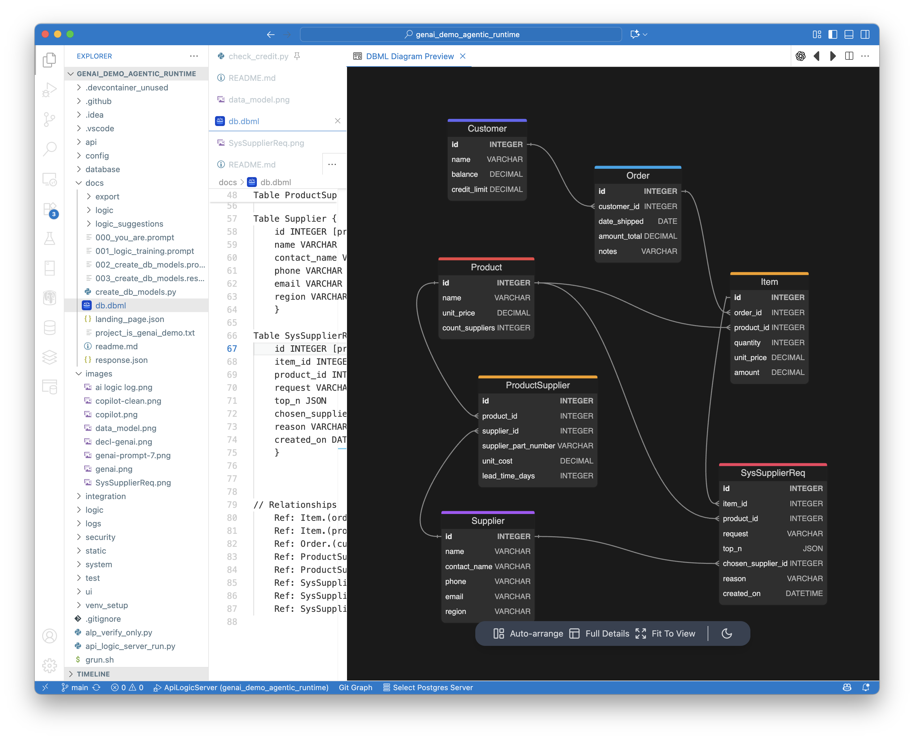

# Probabilistic + Deterministic Rules: A Working Demo

## The Challenge

Agentic systems promise to transform enterprise software, but face a critical reliability challenge. As one skeptic put it: "Nobody wants a probabilistic payroll system."  Check out the comments, [here](https://www.youtube.com/watch?v=uGOLYz2pgr8&t=463s).

> **Both sides are right.** We need AI's adaptive intelligence (**PR:** Probabalistic Rules) AND deterministic guarantees (**DR:** Deterministic Rules) for compliance and reliability. This demo shows how they work together in a production architecture.

<br>

## Background: GenAI-Logic

To understand the demo, you will need a basic understanding of GenAI-Logic.

### What is GenAI-Logic?

**[GenAI-Logic](genai-logic.com)** is an open-source framework ([GitHub](https://github.com/ApiLogicServer/ApiLogicServer-src)) that **generates enterprise applications from natural language prompts,** then executes them using declarative business rules. It addresses what we call ["The Missing Half of GenAI"](https://medium.com/@valjhuber/the-missing-half-of-genai-and-why-microsofts-ceo-says-it-s-the-future-c6fc05d93640) - reliable, maintainable business logic that current AI code generation fails to produce.

**Key capabilities:**
- Generates complete applications (database, API, UI) from prompts, from either [WebGenAI](https://apifabric.ai/admin-app/) (a web app, shown below), or [Copilot vibe](https://medium.com/@valjhuber/vibe-with-copilot-and-genai-logic-925894574125); you can also generate systems from existing databases (e.g. for [MCP](https://medium.com/@valjhuber/vibe-an-mcp-server-declarative-genai-logic-dec16719c004))
- Translates natural language requirements into declarative rules (40× more concise than procedural code)
- Executes rules using its (non RETE) declarative rules engine, providing automatic dependency management and [Enterprise-class O(1) performance](https://medium.com/@valjhuber/living-with-logic-7e202782d0c5) through delta propagation 
- Extends naturally to integrate probabilistic AI decisions within deterministic guardrails

This demo shows that last capability - how probabilistic and deterministic logic work together.

<br>

### GenAI-Logic Uses GenAI for *Creation* and *Execution*

GenAI-Logic uses AI in two distinct ways:

**1. GenAI *Creates* DR (Deterministic Rules)** (Design Time)
- Natural language requirements → Declarative business rules
- Example: "Customer balance is sum of unshipped orders" → `Rule.sum(...)`
- Avoids the "FrankenCode" problem where AI generates unmaintainable procedural logic
- Rules are Python DSL - readable, version-controlled, debuggable

**2. GenAI *Executes* PR (Probabilistic Decision Rules)** (Runtime)
- AI makes optimization decisions (supplier selection, dynamic pricing, predictions)
- Operates within boundaries defined by deterministic rules
- Every decision validated by existing business constraints
- Full audit trail with AI reasoning captured

DR creation has been the most common usage.  This demo explores PR, used with DR.

<br>

## How It Works: The Demo

### I. Initial Creation: WebGenAI prompt

This project was created using [WebGenAI](https://apifabric.ai/admin-app/) - which generates a full-stack enterprise app from a natural language prompt in about a minute:


**The prompt** (shown above) describes business requirements in natural language. GenAI-Logic translates this into a running system:

1. *Declarative business rules,* 40× more concise than procedural code. For the rationale, see ["The Missing Half of GenAI"](https://medium.com/@valjhuber/the-missing-half-of-genai-and-why-microsofts-ceo-says-it-s-the-future-c6fc05d93640).
2. *A multi-table API* that enforces the logic.
3. *A multi-table Admin App* to browse and update your data (add custom apps using vibe, such as copilot).

For more on *system vibe*, [click here](https://medium.com/@valjhuber/vibe-with-copilot-and-genai-logic-925894574125).


**The generated rules handle the standard business logic:**
```python
# Customer balance = sum of unshipped order totals
Rule.sum(derive=Customer.balance, as_sum_of=Order.amount_total,
         where=lambda row: row.date_shipped is None)

# Credit limit constraint
Rule.constraint(validate=Customer,
                as_condition=lambda row: row.balance <= row.credit_limit,
                error_msg="Customer balance exceeds credit limit")
```

<br>

### II. Extension: Adding Probabilistic AI

We extended this generated system to demonstrate PR/DR integration by adding:

**1. Supplier selection tables** (`Supplier`, `ProductSupplier`, `SysSupplierReq`).  See Appendix 1.

**2. A deterministic rule that decides when to invoke AI:** - the relevant code is in `logic/logic_discovery/check_credit.py`.  We replaced the simple `Item.unit_price` rule expression with a rule function:

```python
    def ItemUnitPriceFromSupplier(row: models.Item, old_row: models.Item, logic_row: LogicRow):
        """Deterministic rule decides when AI should run."""
        if row.product.count_suppliers == 0:
            logic_row.debug(f"Item {row.id} - Product not from supplier")
            return row.product.unit_price  # No change if no supplier
        # #als: triggered inserts - https://apilogicserver.github.io/Docs/Logic-Use/#in-logic
        logic_row.log(f"Formula ItemUnitPriceFromSupplier(): use AI to compute unit_price by inserting SysSupplierReq (request pattern) to choose supplier")
        sys_supplier_req_logic_row : models.SysSupplierReq = logic_row.new_logic_row(models.SysSupplierReq)
        sys_supplier_req = sys_supplier_req_logic_row.row
        sys_supplier_req_logic_row.link(to_parent=logic_row)
        sys_supplier_req.product_id = row.product_id
        sys_supplier_req.item_id = row.id
        # this calls choose_supplier_for_item_with_ai, which sets chosen_supplier_id and chosen_unit_price
        sys_supplier_req_logic_row.insert(reason="Supplier Svc Request ", row=sys_supplier_req)  # triggers rules...
        return sys_supplier_req.chosen_unit_price

Rule.formula(derive=Item.unit_price, calling=ItemUnitPriceFromSupplier)  # invokes the function above
```

**3. A probabilistic rule that calls OpenAI to choose suppliers:**

The `sys_supplier_req_logic_row.insert` is a common logic pattern (the [request pattern](https://apilogicserver.github.io/Docs/Logic/#rule-patterns)), so that inserts trigger the following event logic to call AI:

```python
def choose_supplier_for_item_with_ai(row: SysSupplierReq, old_row, logic_row):
        if logic_row.is_inserted():
            # Call AI service to choose supplier based on request and top_n
            supplier_options = get_supplier_options(row=row)
            chosen_supplier, reason, request = call_ai_service_to_choose_supplier(supplier_options)
            row.chosen_supplier_id = chosen_supplier.supplier_id
            row.chosen_unit_price = chosen_supplier.unit_cost
            row.request = request
            row.reason = reason  # audit trail for governance
    
Rule.early_row_event(SysSupplierReq, calling=choose_supplier_for_item_with_ai)
```

<br>

### How It Works: The Log Tells the Story

Here is a sketch of the design (data model diagram created by GenAI-Logic - see Appendix 1):


When you add an item to a line item for an order (e.g. via the Admin App), the debug console shows exactly what happens:


**Step 1: Deterministic Rule Decides** - Does this product have multiple suppliers? If yes, invoke AI, as shown by this log entry:
```
..Item[None] {Formula ItemUnitPriceFromSupplier(): use AI to compute unit_price by inserting SysSupplierReq
```

<br>

**Step 2: AI Reasons Probabilistically** - Given world conditions (Suez Canal blocked), AI chooses New Jersey supplier ($205) over Near East supplier ($105) for faster delivery:

```
HTTP Request: POST https://api.openai.com/v1/chat/completions "HTTP/1.1 200 OK"

......SysSupplierReq[None] {Chosen supplier 2 with reason 'The Suez Canal obstruction 
      significantly impacts lead time from Near East suppliers. Choosing a supplier 
      from New Jersey ensures quicker and more reliable delivery despite a higher 
      unit cost.' for SysSupplierReq None}
```


<br>

**Step 3: Deterministic Rules Cascade** - Item amount → Order total → Customer balance (automatically adjusted):

```
..Item[None] {Formula unit_price} unit_price: 205.00
..Item[None] {Formula amount} amount: 205.00

....Order[2] {Update - Adjusting order: amount_total} [635.00 --> 840.00]

......Customer[2] {Update - Adjusting customer: balance} [635.00 --> 840.00]
```

<br>

**Step 4: Guardrails Validate** - Credit limit constraint automatically checks if the AI's choice would violate business rules. If it does, the transaction fails with a clear error.

<br>

**Step 5: Audit** - The request object (`models.SysSupplierReq`) is persisted to the database, containing the prompt, result and reason.  See the screen shot below.


<br>

### The Guardrail in Action

To see the credit limit constraint reject an AI decision, try this:

1. Set Customer credit_limit to 700
2. Add an item - AI will select expensive supplier (pushing balance to 840)
3. Transaction fails: "Customer balance exceeds credit limit"
4. System can retry with cost-optimized AI parameters

The key insight: **No special "AI safety code" was written.** The existing credit limit rule - created in the initial WebGenAI creation - now also governs PR.

<br>

### PR Auditing in Action

The use of the request objects means we have a database row for each AI call.  As shown below, it shows us the inputs, outputs and reason, using the automatically created Admin App:


<br>

## Why This Matters vs. Other Approaches

**Compared to LangChain/agent frameworks:**
- **LangChain**: Great for orchestrating AI calls, but no built-in business logic engine. You'd write procedural code to validate decisions.
- **GenAI-Logic**: Declarative rules provide automatic validation, cascading updates, and audit trails. The logic is reusable across all decision sources (human, AI, batch jobs).

**Compared to AI-generated code:**
- ***Procedural GenAI**: Without GenAI-Logic, AI generates procedural code that's hard to maintain. Each derivations and validation is custom code scattered across your application.  And it's buggy - AI is known to struggle with complex dependencies.
- **GenAI-Logic**: Rules are 40× more concise, automatically enforce dependencies, and adapt when requirements change. Change one rule, behavior updates everywhere.


**Compared to traditional rule engines:**
- **Rete engines**: Recalculate aggregates on every change (O(n) complexity). Performance degrades with data size.
- **GenAI-Logic**: Delta propagation means O(1) updates regardless of data volume. 120× faster in real-world scenarios.

<br>

## Try It Yourself

### Prerequisites
- Python 3.10+
- OpenAI API key (for AI supplier selection) - set as `APILOGICSERVER_CHATGPT_APIKEY` environment variable
- Or run without API key - system falls back to first available supplier

### Installation

```bash
# Clone the repository
git clone https://github.com/valhuber/genai_demo_agentic_runtime.git
cd genai_demo_agentic_runtime

# Install API Logic Server
pip install ApiLogicServer

# Run the project
ApiLogicServer run
```

### Run the Demo

1. **Start the server**: Press F5 in VSCode, or run `ApiLogicServer run`

2. **Open the Admin UI**: Navigate to `http://localhost:5656`

3. **Trigger the AI flow**:
   - Navigate to Orders
   - Select Order #2
   - Add a new Item
   - Choose Egyptian Cotton Sheets (which has multiple suppliers)
   - Set quantity to 1
   - Click Save

4. **Watch the console**: You'll see the complete logic trace showing:
   - DR deciding to invoke AI
   - OpenAI API call with Suez Canal context
   - AI reasoning and supplier choice
   - DR cascade updating totals and balance
   - DR validation of credit limit

5. **View the audit trail**: Check the `SysSupplierReq` table to see the full AI reasoning captured


### Experiment

**Test the guardrails:**
```python
# In Admin UI, reduce Customer #2 credit_limit to 700
# Then add an item - watch the transaction fail when AI chooses expensive supplier
```

**Change world conditions:**
```python
# Edit logic/declare_logic.py line 89:
world_conditions = 'supplier strike in New Jersey'  # AI will choose different supplier
```

<br>

## Project Structure

```
genai_demo_agentic_runtime/
├── database/
│   ├── models.py          # SQLAlchemy models (generated)
│   └── db.sqlite          # Database with sample data
├── logic/
│   └── declare_logic.py   # Business rules (DR + PR integration)
├── ui/
│   └── admin/             # React Admin app (generated)
├── api/
│   └── expose_api.py      # JSON:API endpoints (generated)
└── images/
    └── ai logic log.png   # Execution trace showing PR/DR flow

```

**Key files:**
- `logic/declare_logic.py` - All business rules including AI integration
- `database/models.py` - Data model including `SysSupplierReq` audit table

## For More Information

**Articles:**
- [The Missing Half of GenAI](https://medium.com/@valjhuber/the-missing-half-of-genai-and-why-microsofts-ceo-says-it-s-the-future-c6fc05d93640) - Why declarative logic matters
- [Probabilistic + Deterministic Rules](https://medium.com/@valjhuber/probabilistic-and-deterministic-logic-9a38f98d24a8) - Full architectural perspective

**Documentation:**
- [API Logic Server docs](https://apilogicserver.github.io/Docs/)
- [Declarative rules reference](https://apilogicserver.github.io/Docs/Logic/)
- [WebGenAI](https://apilogicserver.github.io/Docs/WebGenAI/)

<br>

## Appendix 1: Data Model

We extended the database model/schema using **Copilot vibe.**  That is not native to Copilot - ***GenAI-Logic provides learning*** for Copilot to use SQLAlchemy Alembic.  While the focus here is on logic, logic depends on the data model: iterations require data model iterations.  Historically, these have represented friction, even in prior systems that provided declarative rules.  Schema / model automation proved to be yet another valuable aspect of AI.

GenAI-Logic creates a dbml file from your model, which can be previewed in VSCode as shown below:



<br>

## Contact

Val Huber - Creator of GenAI-Logic
- [LinkedIn](https://www.linkedin.com/in/val-huber-6738401/)
- [Medium](https://medium.com/@valjhuber)
- Email: val@apilogicserver.com
